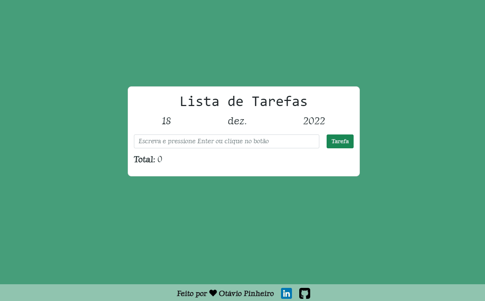

# Lista de Tarefas

<h4 align="center"> 
Finalizado! 🚀 
</h4>

## 💻 Sobre:

Lista de tarefas criada com HTML5, CSS3, Bootstrap e JavaScript. Utilizei JSON Local Storage para guardar os dados da lista.

## 📝 Características:

Se abrir a aplicação no celular, tablet ou qualquer tipo de tela, a aplicação se adapta.

## 🏁 Instalação:

Antes de começar, é bom ter um editor para trabalhar com o código, como: [VSCode](https://code.visualstudio.com/). Clone este repositório usando git clone: https://github.com/otaviopdev/Lista_de_Tarefas.git ou clique em Code/Download ZIP. Clique no arquivo "index.html" e veja a aplicação.

## 🛠️ Tecnologias Utilizadas:

Principais tecnologias usadas neste projeto:

- [HTML5](https://developer.mozilla.org/pt-BR/docs/Web/HTML)
- [CSS3](https://developer.mozilla.org/pt-BR/docs/Web/CSS)
- [Bootstrap](https://getbootstrap.com)
- [JavaScript](https://developer.mozilla.org/pt-BR/docs/Web/JavaScript)

## 📄 Licença:

Este projeto está sob a licença MIT. Veja o arquivo [LICENSE](https://github.com/otaviopdev/Simple_Landing_Page/blob/main/LICENSE) para mais detalhes.

## ✒ Autor:

<a href="https://github.com/otaviopdev">
  
  
 <b>Otávio Pinheiro</b>
</a> 
<a href="https://github.com/otaviopdev" title="Github">🚀</a>

Feito com ❤️ por Otávio Pinheiro. Entre em contato! 👋🏽

